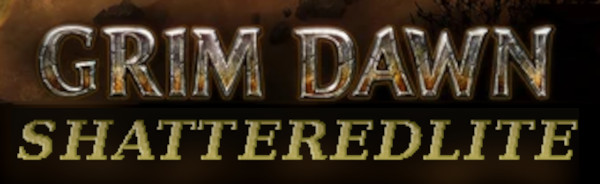

Are you tired of going through Act 1 every single time you begin a new playthrough of [Grim Dawn](https://www.grimdawn.com)? **Shatteredlite** is a mod for Grim Dawn's [Shattered Realm](https://grimdawn.fandom.com/wiki/The_Shattered_Realm), allowing you to enjoy more immediate content variety and to **play the game as a roguelite**.

**Features**:

* Access to the Shattered Realm in as little as a minute after starting a new playthrough!
* Much faster progression compared to the base game and vanilla Shattered Realm!
* Devotion points can be purchased from Mazaan, with the devotion point limit removed!
* A journeyman's pack to start your journey, with tonics, elixirs, experience and iron!
* Deeper shards can be accessed after unlocked without needing waystones!
* Garrus, Keeper of Iron now also sells stacks of scrap.
* Only 1 level per shard (plus boss fight).

## How to install

1. Make sure you have [the Forgotten Gods DLC](https://grimdawn.fandom.com/wiki/Forgotten_Gods) installed
2. [Download the latest release of Shatteredlite](https://github.com/tukkek/shatteredlite/releases/latest/)
3. Extract the ZIP file inside Grim Dawn's `mods/` folder

If you are using [Steam](https://store.steampowered.com), to find the game's installation you can right-click on *Grim Dawn* in your games list and select *Manage → Browse local files*. It should look something like this:

    .../steamapps/common/Grim Dawn/

Your operating system should come with a default archive tool but [7zip](https://www.7-zip.org/download.html) is a free option in case you need it.

## How to play

1. Create a new character, making sure you select the custom game *Shatteredlite*.
2. Talk to Bourbon and use the new dialog option to refuse to help Devil's Crossing.
3. Shop for an initial set of gear and components to help you tackle your first shard.
4. Talk to the Emissary to gain entry then go to the Conclave of the Three.
5. Talk directly to Mazaan who will immediately open the Shattered Realm.

## Contact and support

If you enjoy this mod or want to provide feedback and discuss ideas, consider dropping by [Discord](https://discord.gg/5sXXcwPCSP) to say hi!

## Rationale

With DLC, Grim Dawn offers multiple paths to take after finishing the first part of the story but Act 1 is always the same and eventually gets stale, even with the many differences between each playthrough. It's also long, [taking the best players in the community one or two hours to beat](https://youtu.be/Uir5qz5UB0I). That is quite long for a mandatory tutorial of sorts, especially for those players looking for a more [roguelite](https://youtu.be/-cu5RkWoW2M) experience.

After all, why shouldn't Grim Dawn be a roguelite? It has unlimited possibilites for character builds and theorycrafting, a hardcore mode, loot and even a lot of procedural generation - even if maps are largely static (a shortcoming that the Shattered Realm also mitigates with its many random levels).

Unlocking the Shattered Realm early provides access to over 70 different maps and deeper gameplay compared to leveling in the first acts. It's the closest experience to a true roguelite you can get in Grim Dawn, while leveraging the official content already in the game for the most balance and polish.

While there are alternatives to accessing more content early on, they are all clunky, meta-gamey and often hurting early-game balance and progression. The players who are even aware they exist use those because it's the lesser of two evils, not necessarily because they're enjoyable or the best approach to increasing early-game replay-value.

## Balance

Shatteredlite has been tested under a variety of masteries and character builds for Normal difficulty, [solo-self-found](https://pathofexile.fandom.com/wiki/Solo_Self-Found), hardcore-mode-friendly balance. It is not necessarily easy or fast at first but very doable and overall much faster to level in, compared to completing all the main quests in Act 1.

Players who find this mod too hard even after following the guidelines here are encouraged to clear a little more of Act 1 for extra experience, gear, consumbales and bits to shop with before entering the Shattered Realm proper. Following a [build guide](https://forums.crateentertainment.com/t/build-compendium-x-forgotten-gods/49673) might help as well for those struggling to survive their first shards.

Upon reaching level 15, vanilla balance can be assumed as this is the minimum level a player is expected to start playing Act 7 after finishing the main quests in Act 1.

### Goals

The goal for Shatteredlite is to allow experienced players leveling up to 50 on normal difficulty, to do so semi-casually, in a solo-self-found manner in around 4 hours with a fresh start (no stash, merits)... While close to that, this is still a work-in-progress. From there, leveling to 100 in another 4 hours is a secondary goal.

The huge variance in loot drops and build variety in the game and also in player skill and knowledge makes these goals somewhat hard to measure objectively. The time necessary to do multiple full runs is also prohibitive for a hobby project. As such, the best possible approach is to rely on anecdotal experience and feedback.

### Initial rewards from Bourbon

These were introduced in version 1.4 and are a significant boon compared to the previous starting kit (then granted by the Emissary).

The initial approach was to provide a "bare minimum" set of resources that would allow every build to start tackling the Shattered Realm (some more or less effectively) - this was a conservative method, trying to stay as close to vanilla balance as realistic while still making SR-only runs possible.

Extensive playtesting since version 1.0 showed that while 100% feasible, this lead to a fairly stale early game. The new, more generous approach to free resources aims to shorten the early progression by half, serving as a shortcut to the more strategic theory-crafting moments while still maintaning some of that slower ramp-up at the start.

The amount of 20,000 iron bits is enough to purchase a full set of magic gear at the Devil's Crossing shop, allowing for some interesting decision-making at the very start. The experience given to reach level 5 is also deliberate, as it allows obtaining and using components with area-of-effect skills, which are crucial for some builds early on. The inventory bag is a replacement for the water-pump quest in Act 1, which cannot be obtained within the Shattered Realm.

Players who find the initial resources too plentiful are welcome to discard part of them before venturing into Act 7.

### Less floors

Arguably the biggest change from vanilla Shattered Realm, this is absolutely crucial to implement the much more short-term rogue-lite approach to playng a character than that of the base game which expects players to beat the campaign acts three times in a row. While some outlier builds can progress very fast, especially early on (or maybe if following a pre-planned build guide as well), the less optimized solo-self-found builds would be painfully slow for the rogue-lite pacing of the mod, even with only 2 floors.

The single-floor approach also highlights the most unique feature of the Shattered Realm compared to the campaign and Crucible: the dedicated multi-boss fights, whose ample permutations fit particularly well into a rogue-lite mod. In this way, the non-boss floors act almost like a breather between more frequent high-intensity boss fights than being the vast bulk of the content as it is in the vanilla game.

There is a downside to that, which is that character builds are more incentivized to become boss-killers than speed-clearers more focused on killing packs of mobs. This isn't necessarily bad as much as different, but certainly less intentional than the deliberate original pacing. Speed-clear is still somewhat necessary and benefitial, but less so.

The lower number of floors is also highly helpful in allowing players to reach deeper shards faster on the given time, with average builds taking only a couple tries to clear the first couple shards or so on time. This is important to allow players to find their optimal challenge level without being gated by the arbitrary timer, while also providing better rewards earlier for faster progression. Otherwise, even mid-level SSF builds would struggle to make progress deeper into the further shards in the game.

SR is overtly balanced for optimized high-level characters, with many of its intended rewards being exclusive to levels 50 (movement augments) to 94 (item set). These changes, while a departure from vanilla balance, also allow fresh characters to experience the SR in a manner roughly equivalent to its intended gameplay, while also offering much faster progression for maximum theory-crafting potential and more freedom for players to choose the balance between risk and rewards most suited to their own play-style.

Another way having 3 floors in a row is different than the campaign is that you are not freely able go back to town and stock up on consumables - this is more of an issue very early on, as it's the only point in the game when players don't have access to a practically-unlimited amount of consumables. In comparison, you can go back to town and spend any iron bits you found on tonics and elixirs at literally any time you're not in active combat during the main quests in Act 1.

### Devotions

The approach to devotions is vastly different from the base game. They are a very cheap way to achieve power that also inherently scales further without more investment. The abilty to easily gain more devotion points beyond the cap of the vanilla game and from there get every devotion available further reinforces that.

Buying devotion points with iron bits also gives lower- to mid-level characters a more interesting way to spend iron bits than shopping for minimal lower-rarity upgrades to the unique items they can get from the SR rewards. It also allows players "stuck" in a shard to always make progress towards more power gain, further benefitting the pacing.

While this would trivialize the campaign acts, the Shattered Realm is self-balancing in the sense that players can push for much harder content than in the base game - either by using waystones to access content usually only reserved for min-maxed, pre-planned builds or by doing longer endurance-style runs from the first shard.

In other words, leveraging devotions allows for a rogue-lite experience that is much faster, with more theory-crafting options and that allows low-level characters to access more content from the Shattered Realm earlier. If other avenues are found to achieve these goals, devotion access can then be reigned back.

### Quest rewards

Eldritch Essences rewarded by Shattered Realm quests were replaced with iron bits (an Iron Bar's worth per Essence). Since Essences are no longer needed to craft Waystones to access deeper shards, they are less immediately useful for lower level characters and that extra boon can either be spent or exchanged for Iron Bars and stashed by players who want to convert them into meta-progression.

No other loot-table was altered so Essences needed for crafting recipes can still be farmed where they'd natually spawn, including from non-quest SR rewards.

Another use for these iron rewards is to exchange them for scrap metal with Garrus, the Keeper of Iron. This in turn allows players to craft enchanted items liberally at the Conclave's blacksmith, which can generate very powerful items with double-rare affixes!
